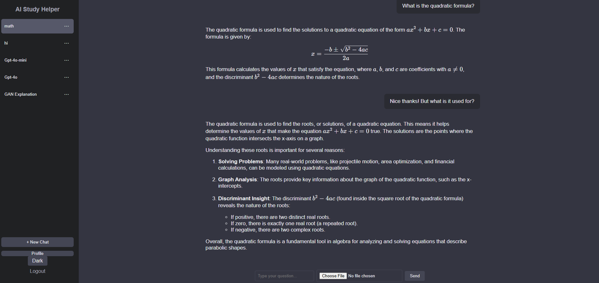
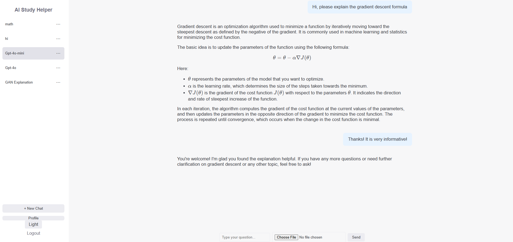

# AI Study Helper

## Overview
AI Study Helper is a web-based AI study assistant designed to support learning in Math, Science, and English. The project explores how large language models (LLMs), multimodal input, and structured application logic can be combined to generate clear, step-by-step explanations for academic problems.

The system focuses on explainability and interaction design rather than answer generation alone.

## User Interface Preview

## Core Features
- **Conversational AI Interface**  
  Enables natural language interaction with follow-up questions for deeper clarification.

- **Subject-Aware Responses**  
  Handles queries across Math, Science, and English with context-appropriate explanations.

- **Multimodal Input**  
  Supports both text input and image-based queries (e.g. handwritten work or textbook problems).

- **Step-by-Step Reasoning**  
  Produces structured explanations to guide understanding of problem-solving processes.

- **Session Context (Experimental)**  
  Maintains limited conversational context within a session to improve response continuity.

- **Web-Based User Interface**  
  Implemented with a responsive UI suitable for desktop and mobile browsers.

## System Architecture
- **Frontend:** React.js  
- **Backend:** FastAPI (Python)  
- **Database:** PostgreSQL  
- **AI / ML:** Integration with LLM APIs (OpenAI)  
- **Environment & Dependency Management:** Conda  
- **Version Control:** Git (GitHub)

The frontend communicates with the FastAPI backend via RESTful APIs, while PostgreSQL is used for managing application data and session-related information.

## Technical Approach
- Designed a modular backend to separate request handling, AI interaction, and data management  
- Integrated LLM APIs to generate structured explanations rather than short-form answers  
- Implemented basic session-level context handling to support multi-turn interactions  
- Prioritized readability, maintainability, and extensibility of the codebase

## Design Considerations
- Emphasis on learning support and explanation quality  
- Clear separation of frontend, backend, and AI logic  
- Built as a foundation for experimenting with AI-assisted education systems

## Limitations
- Not intended to replace formal education or human instruction  
- Long-term personalization and adaptive learning are exploratory  
- Response quality depends on input clarity and model behavior

## Project Motivation
This project was built to explore practical applications of large language models in education, with a focus on system architecture, explainability, and user interaction rather than production deployment.
